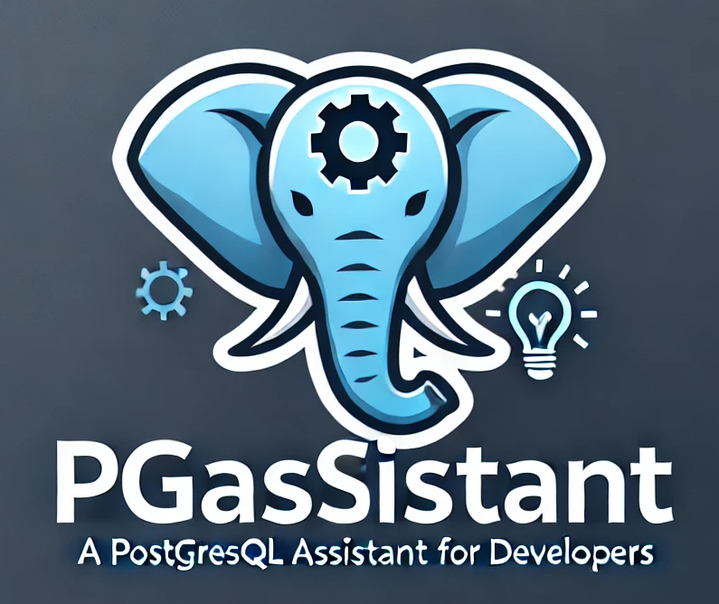
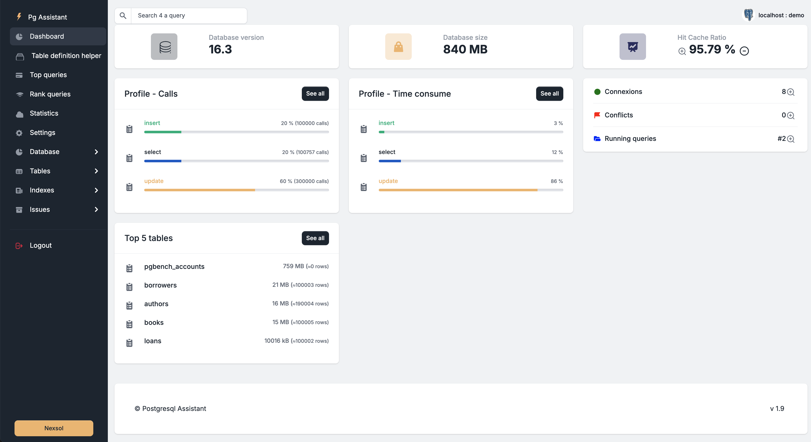

<p align="center">
  
  <br>
  <em>A PostgreSQL assistant for developers<br />
      designed to help understand and optimize PostgreSQL database performance.</em>
  <br>
</p>

PgAssistant is an open-source tool designed to help developers understand and optimize their PostgreSQL database performance. It provides insights into database behavior, identifies schema-related issues, and assists in correcting them. Additionally, PgAssistant makes it easy to manage a library of specific SQL queries useful for your project through a simple JSON file.

## Features

- **Database Behavior Analysis**: Understand how your PostgreSQL database is performing with detailed analysis.
- **Schema Optimization**: Identify and correct [issues](media/issues.png) related to your database schema.
- **Query Library Management**: Easily manage a library of specific SQL queries using a [JSON file](media/myqueries.png).
- **User-Friendly Interface**: Simple and intuitive interface for ease of use.
- **Lint SQL Code**: Pgassistant is using Python **Sqlfluff** to lint your SQL code 
- **OpenAI helper**: If you have an OpenAI account, the interface can query OpenAI to help you understand your query plan and optimize your SQL queries
- **Local LLM helper**: If you run a local LLM like [**ollama**](media/llama.png), you can use it also with pgAssistant
- **LLM helper**: If you use a different LLM than OpenAI or ollama, PgAssistant will help you correctly formulate a query to prompt your preferred [LLM engine](media/prompt.png).
- **Get DDL**: get DDL of Top [queries](media/ddl.png) - pgAssistant is using **pg_dump** to achieve this.
- **PGTune**: [PGTune](media/pgtune.png) is on board. Connected to your DB, pgAssistant can help your ALTER SYSTEM parameters !
- **Docker**: based on pgTune recommandations, pgAssistant can help you writing a [docker-compose](media/pgtune-docker.png)

## Screen shots




## Before you begin

pgAssistant needs the **pg_stat_statements** postgresql module to run. 

To activate this module on your database is very simple. Below, you will find an example of how to activate it if you are in a Docker environment, as well as the PostgreSQL documentation.

- Docker environnement sample here : https://github.com/nexsol-technologies/pgassistant-postgres-sample/tree/main
- Postgresql documentation here : https://www.postgresql.org/docs/current/pgstatstatements.html

## Special thanks

Not being a front-end developer, I would like to thank the team that developed Volt BootStrap 5, which is available here: https://github.com/themesberg/volt-bootstrap-5-dashboard. Thank you guys, you saved my life !
I've used this project to develop the application' interface.

## Using LLM with pgAssistant

Take a look at this documentation : [here](LLM.md)

## Understanding the myqueries.json file

**myqueries.json** file is used to store your helpfull queries. 

Each querie you add to the json file can be searched and executed by pgAssistant.

The JSON format is very simple :
```json
        {
            "id": "db_version",
            "description": "Database version",
            "category": "Database",        
            "sql": "SHOW server_version;",
            "type": "select"
            "reference": "https://www.postgresql.org/docs/current/sql-show.html"
        }
```

- **id** A unique ID of the query
- **description** The description of your SQL query
- **categorie** A SQL category like Database, Issue, Table, Index or whatever you want
- **sql** The SQL query ended with a ";"
- **reference** An URL on the query documentation or your project documentation
- **type** 2 sql types are alowed 
   - select : performing a select
   - param_query : a select query with parameters. Each parameter must be in the format $1, $2, etc.

## ✅ Start in `Docker` and use the Nexsol technologies image

Use this [docker-compse.yml](docker-compose/docker-compose.yml) and run :

```bash
$ docker-compose up 
```

Visit `http://localhost:8080/database.html` in your browser. The app should be up & running.


## ✅ Manual Build

> Download the code 

<br />

### 👉 Set Up for `Unix`, `MacOS` 

> Install modules via `VENV`  

```bash
$ virtualenv env
$ source env/bin/activate
$ pip3 install -r requirements.txt
```

<br />

> Set Up Flask Environment

```bash
$ export FLASK_APP=run.py
```

<br />

> Start the app

```bash
$ flask run
// OR
$ flask run --cert=adhoc # For HTTPS server
```

At this point, the app runs at `http://127.0.0.1:5000/database.html`. 

<br />


