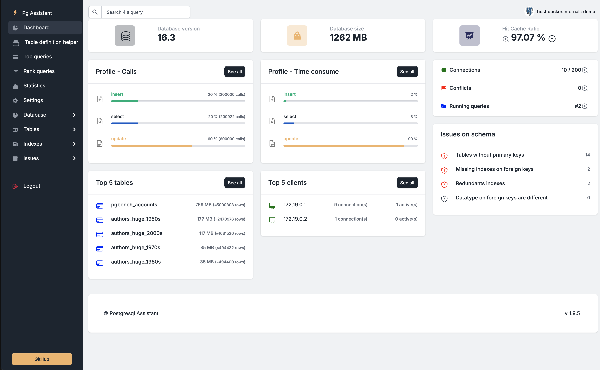

  
   
  <em>A PostgreSQL assistant for developers 
      designed to help understand and optimize PostgreSQL database performance.</em>
   

PgAssistant is an open-source tool designed to help developers understand and optimize their PostgreSQL database performance. It provides insights into database behavior, identifies schema-related issues, and assists in correcting them. Additionally, PgAssistant makes it easy to manage a library of specific SQL queries useful for your project through a simple JSON file.

## Features

- **Database Behavior Analysis**: Understand how your PostgreSQL database is performing with detailed analysis.
- **Schema Optimization**: Identify and correct [issues](media/issues.png) related to your database schema.
- **Query Library Management**: Easily manage a library of specific SQL queries using a [JSON file](media/myqueries.png).
- **User-Friendly Interface**: Simple and intuitive interface for ease of use.
- **Lint SQL Code**: Pgassistant is using Python **Sqlfluff** to lint your SQL code 
- **OpenAI helper**: If you have an OpenAI account, the interface can query OpenAI to help you understand your query plan and optimize your SQL queries
- **Local LLM helper**: If you run a local LLM like [**ollama**](media/llama.png), you can use it also with pgAssistant
- **LLM helper**: If you use a different LLM than OpenAI or ollama, PgAssistant will help you correctly formulate a query to prompt your preferred [LLM engine](media/prompt.png).
- **Get DDL**: get DDL of Top [queries](media/ddl.png) - pgAssistant is using **pg_dump** to achieve this.
- **PGTune**: [PGTune](media/pgtune.png) is on board. Connected to your DB, pgAssistant can help your ALTER SYSTEM parameters !
- **Docker**: based on pgTune recommandations, pgAssistant can help you writing a [docker-compose](media/pgtune-docker.png)
- **On top queries**, pgAssistant help you to provide [values](media/analyze_parameters.png) on parameters and comment the results of EXPLAIN ANALYZE [output](media/analyze_result.png). 
- **NEW in version 1.8**: 
    - **RFC compliance** : For each table, ask the LLM if the table definitions comply with relevant RFC(s). See sample [here](media/table_structure.png). You will find this in a new menu : Table definition.
    - pgAssistant can help you to **find a primary key** with LLM : See sample [here](media/issue_missing_pk.png)
- **NEW in version 1.9**: 
    - Analyze query, use pg_stats to get the most common values of a given parameter. See sample [here](media/analyze_parameters.png)
    - Analyze query, get the indexe coverage of each table and column of the query. See sample [here](media/index_coverage.png)
    - On dashboard, add a link on Hit Cache Ratio zooming on cache usage by table. Quick access on top queries with low usage of cache / index cache. See sample [here](media/cache_usage.png)

---

## Screen shot

---

## Mindset

Some existing tools, can be used to optimize your queries. The strength of these tools lies in their deterministic nature. However, they will never tell you if a column is RFC non-compliant, nor will they suggest alternative ways to optimize a query beyond performance metrics.

We believe that LLMs can accomplish tasks that deterministic tools simply cannot, providing deeper insights, compliance checks, and intelligent query optimizations.

Of course, LLMs can make mistakes—and not just small ones. It’s crucial to choose the right model, test extensively, and always keep in mind that the accuracy rate is not 100%. However, by using models like OpenAI, Claude, or Codestral, which we have tested on numerous databases, we believe pgAssistant can effectively help developers refine their schemas and optimize their queries.

Please use pgAssistant in a non-production environment. The purpose of this tool is to help you fix your database before it goes into production.

Finally, pgAssistant was designed to help developers design and understand their PostgreSQL database. The initial idea was clearly to make developers as autonomous as possible, educate them, and also reduce the need for DBA expertise.

---

## Read the doc

You can find [here](https://beh74.github.io/pgassistant-blog/) the pgAssistant Blog (documentation, posts)

---

## Special thanks

Not being a front-end developer, I would like to thank the team that developed Volt BootStrap 5, which is available here: https://github.com/themesberg/volt-bootstrap-5-dashboard. Thank you guys, you saved my life !
I've used this project to develop the application' interface.

